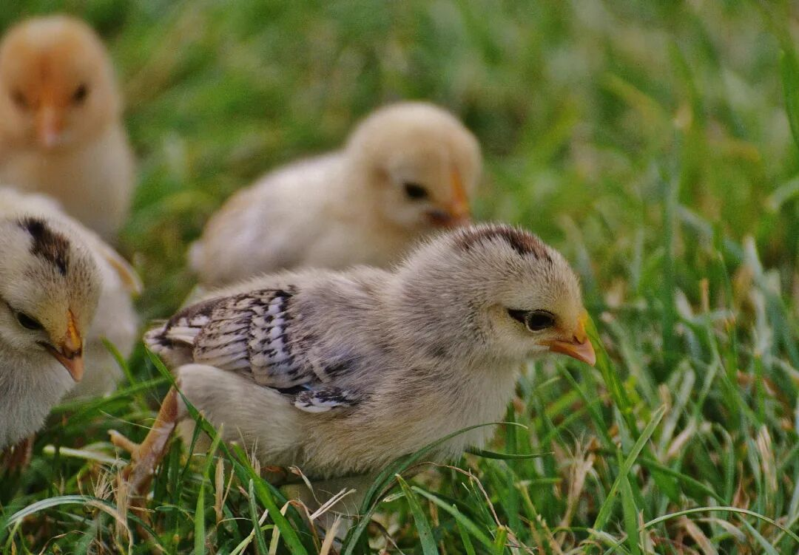
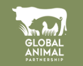
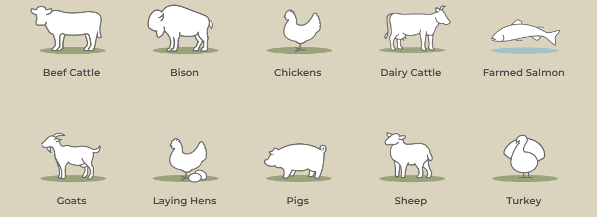
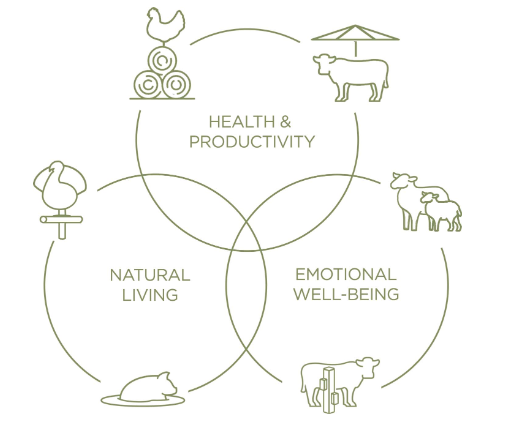
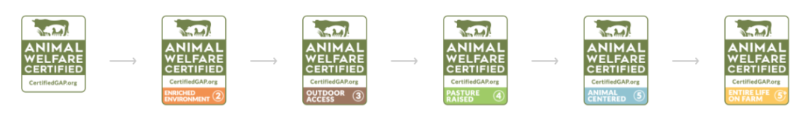
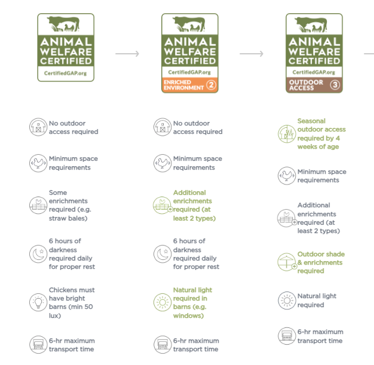
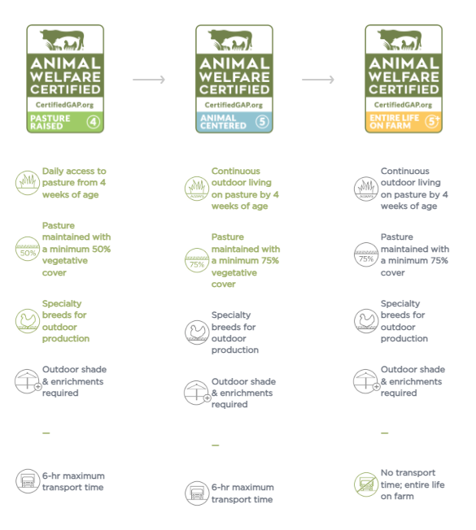

---
title: 光环科普：原来鸡也有GAP？
date: 2025-10-06
author: 周晓彤
summary: 在忙碌的现代生活中，人们渴望从快节奏中休息。而鸡，作为人类广泛饲养的动物，也需要自己的间隔年
catchline: 关爱动物福利，从G.A.P.认证开始
button: 阅读全文
---

<h1 class="article-title">光环科普 | 原来鸡也有GAP？</h1>

在忙碌的现代生活中，人们渴望从快节奏的工作、学习中抽出一段时间好好休息，"gap year"、"gap day"盛行于社交网络。

鸡，作为人类广泛饲养的动物之一，跟随人类进入现代社会后，也呈现出快节奏的状态------在工业化的养鸡场里，每只鸡，从生到死，从孵化、喂养，到宰杀、分解、包装、运输，都由智能系统控制。成千上万只鸡生活在一排排狭窄、拥挤的笼子里，不见天日，不能自由行动，长到一定程度后则被宰杀作为鸡肉供应市场。

Halo自然光环全系宠粮产品所使用的**"持有G.A.P.认证的鸡"**则不然。

  
  
持有G.A.P.认证的鸡在自然环境中生活

## 01 什么是G.A.P.？

全球动物合作组织(Global Animal Partnership）是一个**非营利性的慈善组织**，汇集了农民、牧场主、零售商、科学家、食品服务提供商和动物权益倡导者，致力于通过**人道方式**饲养动物来改善动物的福利状况。

  
  
全球动物合作组织标志

全球动物合作组织的动物福利认证项目评估农场动物的福利水平，制定不同级别的标准，对符合这些标准的农场和加工设施进行认证，并启动了**标签授权计划（LPA）**，将 G.A.P.标签贴在零售商品（培根、肉丸、鸡块等）上。

这些标准和标签旨在确保动物在农场、运输过程中以及屠宰时的福利得到妥善照顾和尊重，消费者也可根据透明的动物福利标准和标签做出明智的购买决定。

作为标准制定者，全球动物合作组织不进行审计也不做出级别认证决定，由 G.A.P.授权的第三方认证机构执行审计、颁发等级证书，并每隔**15个月**审核每个认证农场。对于个别农场，第三方认证机构每隔12个月审核一次，确保其一直符合标准。

  
  
G.A.P.目前认证的动物类别

## 02 G.A.P. 如何定义动物福利？

G.A.P.定义的动物福利为三个相互重叠的组成部分：

**· 健康与生产力。**为动物提供高不含生长激素的素食饲料、水、住所，使动物免受疾病和伤害，并对生病的动物进行治疗，养殖健康且具有生产力的动物。

**· 自然生活。**在室内外环境中养殖动物，允许它们自然行动。

**· 情绪福祉。**在丰富的环境中养殖动物，使它们能够保持好奇和玩耍的能力，尽可能减少它们的不安、挫折、压力和痛苦。

  
  
G.A.P.定义的动物福利三要素

## 03 G.A.P.的标准是什么？

全球动物合作组织的动物福利认证项目共有六级：**第1级、第2级、第3级、第4级、第5级、第5+级**，每个等级都有其特定的要求和规定。

  
  
G.A.P.的6个等级标签

以鸡的饲养为例：

在第1级中，鸡通常生活在固定的住房结构中，有自由行动的空间。

在第2级中，鸡通常生活在有自然光的室内环境中，有自由行动的空间。

在第3级中，鸡在季节条件允许的情况下可以进入室外，室外有鼓励漫步和觅食的各类设施。

  
  
G.A.P.第1级-第3级标准

在第4级中，鸡生活在牧场上，有进入住房的通道；在冬季，鸡可能被带离牧场，但必须每天能够进入室外。

在第5级中，鸡持续地生活在农场上，只有在极端天气条件下才可能被带进室内。

在第5+级中，鸡持续地生活在农场上，并且在农场的屠宰设施上被屠宰。

  
  
G.A.P.第4级-第5+级标准

---

Halo自然光环全系宠粮产品的禽类原料皆来自持有G.A.P.认证的天然农场。与G.A.P.关心动物及其福利的使命相同，Halo自然光环**以改善宠物的饲养方式、优化畜牧业为使命**。我们为宠物提供**纯鲜肉**制作的优质宠物食品的同时，完全认可G.A.P.所倡导的自然饲养模式，采用更加**天然、人道、可持续发展**的方式对待这些给予我们生命支持的动物，尊重它们的生命周期，减少对地球的负面影响。

**每一个生命都头戴光环，**

**值得被世界温柔以待。**

**选择G.A.P.认证宠粮，**

**保护每一个小生命的尊严和美好。**

参考资料：

\[1\]https://globalanimalpartnership.org/

\[2\]https://mp.weixin.qq.com/s\_\_biz=MTg1MjI3MzY2MQ==&mid=2651705223&idx=1&sn=acb7aaf042be5888fc17742c54f46137&chksm=5da1eb156ad66203590624174ec729593077ec9f00dc580b9f72443a19a3fd6676bfd0093301&scene=27

---

💼 本文为作品集展示内容，图文素材来源于本人运营的官方账号，版权归原公司所有 · 仅供求职展示使用

