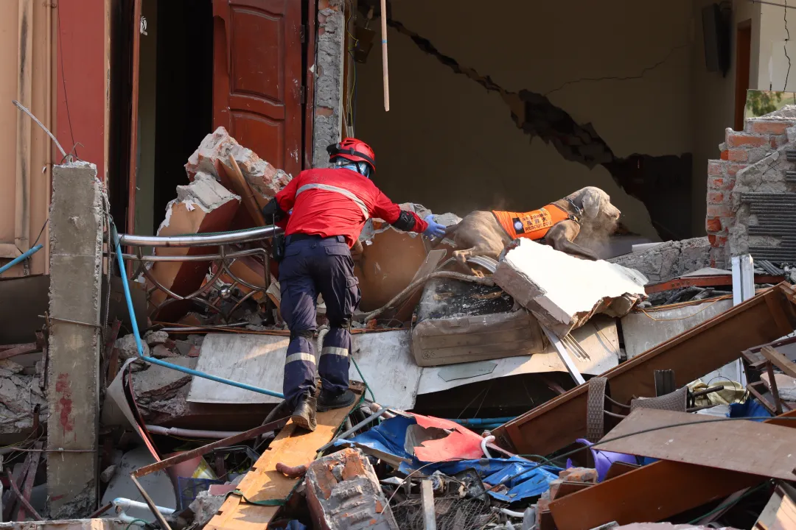
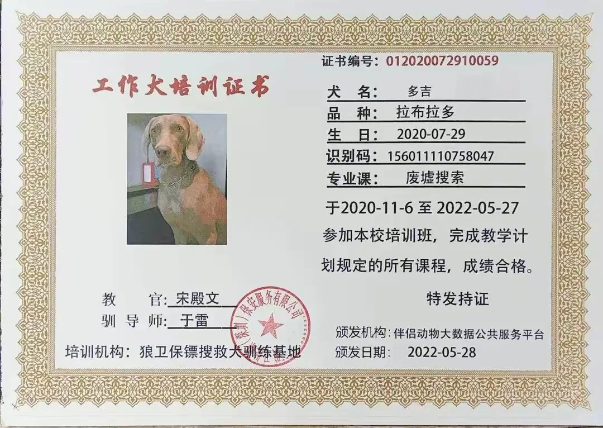
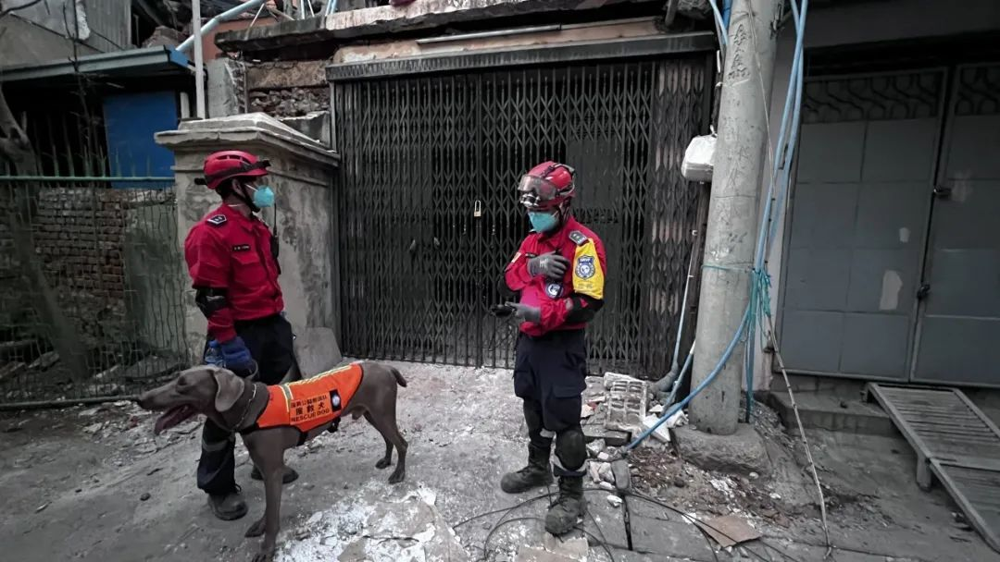
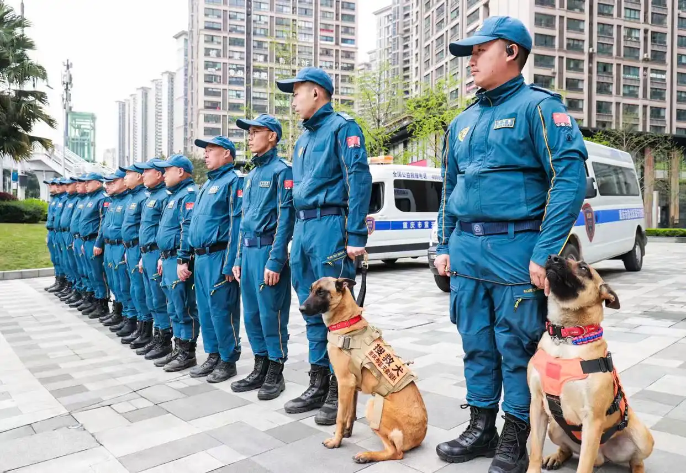
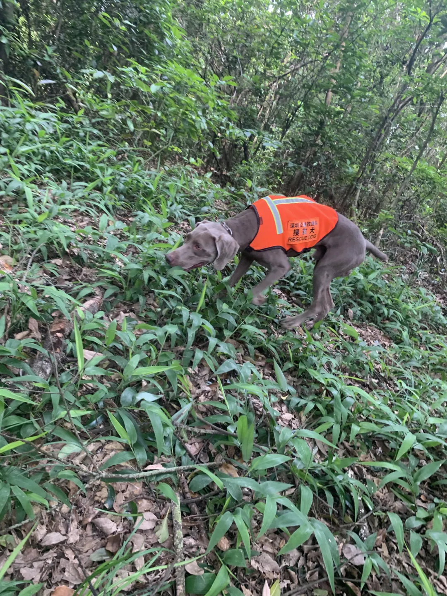
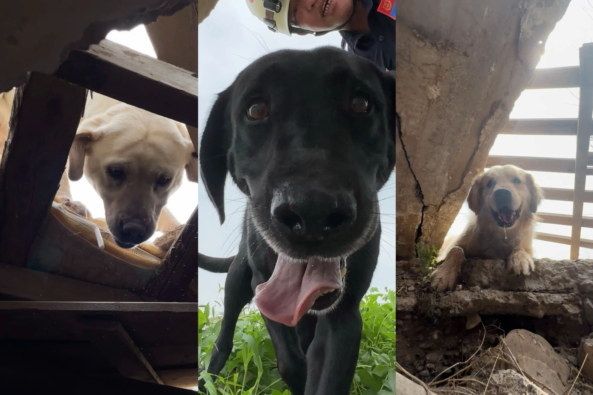

---
title: 点亮世界的毛孩子：用爪子刨出一线生机
date: 2025-10-06
author: 周晓彤
summary: 断裂的水泥块铺满了地面，多吉敏捷地穿梭于废墟中，用鼻尖探寻人类的踪影，用爪子刨出一线生机
catchline: 搜救犬用生命守护生命的故事
button: 阅读全文
image: image1.png
---

<h1 class="article-title">点亮世界的毛孩子 | 用爪子刨出一线生机</h1>

断裂的水泥块铺满了地面，尖尖的玻璃、钉子四处散落，空气中灰白的粉尘清晰可见，多吉敏捷地穿梭于废墟中，用鼻尖探寻人类的踪影，用爪子刨出一线生机。

2025年3月28日14时20分，缅甸发生7.9级地震。搜救犬多吉跟随深圳公益救援队驰援缅甸，与时间竞速，与灾难抗衡。

  
  
多吉在缅甸救援，图源自深视新闻

多吉是一只四岁半的搜救犬，编号22K92，从半岁起接受训练，加入救援队犬组3年，擅长废墟搜索和山地搜索,迄今已参加过多次救援行动。

  
  
多吉的"学历证明"，图源自广州日报

在缅甸受灾严重的曼德勒市，白天最高气温逼近40℃。顶着烈日，多吉穿着橙黄色搜救马甲，灵活地穿过崎岖不平的地面，寻找受困者的痕迹。在晚上，因地震导致基础设施、电力系统严重受损，搜救人员只能借助手电筒照明。多吉穿过黑暗，深入废墟缝隙，抓住震后72小时的生命关键期。即便是困难的工作，勇敢的狗狗也可以完成。

对于幸存者来说，见到搜救犬就是生存的希望。奔跑、嗅闻、吠叫，小狗一定会找到你。

  
  
多吉与救援人员在缅甸救援现场，图源自凤凰网深圳

除了深圳公益救援队，中国救援队与三只搜救犬------"肉肉"、"露露"和"蓝锋"，重庆蓝天救援队与搜救犬"小闪电"、"小蓝天"等多支救援队伍都前往缅甸参与救援。截至当地时间4月1日8时，中国救援队伍共搜救出8名幸存者。

  
  
重庆蓝天救援队准备出发，图源自新华网

地震、泥石流、洪水等灾难发生后，除了英勇的救援人员，搜救犬在救援中发挥着关键作用。犬的嗅觉和听觉极为灵敏，远超人类数倍。凭借超强嗅觉和气味记忆能力，搜救犬可以快速定位灾难中的受困者，增加与死亡角斗的赢率；凭着矫健的身躯，搜救犬可以灵活穿梭于废墟中，深入仪器无法触及的缝隙。在"5.12汶川地震"中，70%的幸存者是由67名搜救犬找到的。

  
  
正在训练的多吉，图源自深圳公益救援队

搜救犬每天都要进行辛苦的训练。搜救犬完成任务关键在于利用灵敏的嗅觉甄别不同气味，如人的汗液、体味、气息等。搜救犬需要进行上千次重复训练、与训导员建立合作的信任，才能保证在复杂环境中完成任何一个固定动作。一次次训练，都是在与危难中的生命竞速------"我要比死亡更先找到你。"

  
  
搜救犬发现幸存者的眼神，图源自中国生灵动物追踪

但是，长年累月的工作却缩短了搜救犬与死亡的距离，搜救犬的寿命一般比普通小狗们短很多------"死亡更先找到了搜救犬们。"长时间用鼻子嗅闻，让搜救犬的肺部负担重；长时间在废墟和恶劣地面上行走、奔跑，让搜救犬的膝盖、关节出现问题。

这些犬类的付出，超越了本能，是一种对人类的信任和承诺。用生命守护生命，它们的勇气和无私令人动容。

这就是"点亮世界的毛孩子"。

人类与动物是共生关系。犬类用生命守护人类，而人类则应以关怀和尊重回报它们。这种关系不仅是对犬类的承诺，更是对人类自身的责任。

每⼀个⽣命都头戴光环，值得被世界温柔以待。

【参考信息】

\[1\]https://www.ichongqing.info/2025/03/30/rescue-dogs-from-chongqing-blue-sky-rescue-team-join-myanmar-earthquake-relief/

\[2\]https://mp.weixin.qq.com/s/IpoEfdBx9oiNuX4rF9Dmjw

\[3\]https://m.thepaper.cn/newsDetail_forward_20959057

\[4\]https://mp.weixin.qq.com/s/zwOxazhcz13nUnP6DUks7A

---

💼 本文为作品集展示内容，图文素材来源于本人运营的官方账号，版权归原公司所有 · 仅供求职展示使用

