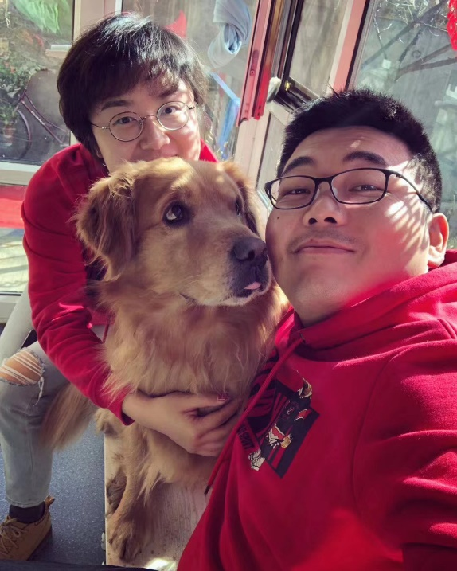

<h1 class="article-title">云南行：四虎的大理故事</h1>

## 关于"囫囵黑小枣"

江湖人称枣姐，目前与三狗三猫、三狗三猫的男主人牛哥、牛哥的妈妈在云南大理生活。

  
  
"囫囵黑小枣"全家福，C位是我们本期的"主人狗"四虎

四虎是一只颇具传奇色彩的金毛，曾是山西大同市的"土著"，后在老年期跨越2500公里，与枣姐、牛哥一同"云漂"，定居大理。究竟是什么让枣姐不惜代价把四虎带到云南呢？

## 横跨6年的心愿

四虎是牛哥在2014年从狗贩子手里买来的，当时牛哥在外求学，便将四虎留在老家大同，交由妈妈、姥姥照顾。从那以后，四虎弥补了牛哥的"被迫缺席"，成为家庭的新成员，与妈妈、姥姥一起生活、互相陪伴。

  
  
四虎与家人的日常

2017年，牛哥与枣姐回老家举办婚礼，本来是人生的大喜事，但婚礼前夜突如起来的车祸，导致牛哥腿部受伤，婚没结成，夫妻俩也没了工作。半年的艰难日子，也是两人得以与四虎亲密相处的半年。四虎陪伴了在家养伤的牛哥，也为枣姐忙碌的陪护生活带来了乐趣。枣姐、牛哥萌发了把四虎带到身边共同生活的念头。

  
  
枣姐与四虎的合影

但四虎与牛哥的妈妈、姥姥共同生活了许多年，早已建立起深厚的感情。枣姐、牛哥在外工作，租住的房子不大，不能为四虎提供足够宽敞的空间。权衡之下，枣姐、牛哥只能放下接四虎的念头。

  
  
四虎在户外活动

牛哥的妈妈、姥姥对四虎是极为爱护的，但是老一辈人科学喂养的意识比较薄弱，四虎出现了比较严重的健康问题------超重、髋关节损伤、难以奔跑。在这种情况下，帮助四虎恢复健康迫在眉睫。2023年，牛哥的妈妈正好退休了，牛哥夫妇下定决心，把妈妈、四虎接到云南共同生活。这场搬离，从"萌发想法"到"执行想法"，足足跨越六年。

## 往返5000公里的搬迁

为了给家里的猫猫狗狗提供充足的活动空间，枣姐、牛哥在大理租了一个小院子，由牛哥负责开车回大同接四虎和妈妈。

从大同到大理约2500公里，为了使四虎能顺利度过这趟旅程，牛哥做了充分的准备。

针对四虎的超重问题，牛哥与妈妈提前带着四虎进行体能锻炼。牛哥还亲手给四虎做了一个脚凳，辅助它上下车。在开车行进的过程中，牛哥也是以四虎的舒适度为主，走走停停，四虎得以在各大服务区留下自己的足迹。四虎也十分争气，慢慢适应这样的生活，一家人终于在大理团聚。

  
  
四虎在旅途中休息

  
  
四虎在户外玩耍

## 健康自由地奔跑

一家人在大理团聚后，枣姐、牛哥可以和四虎近距离生活，解决四虎的健康问题成为新的生活目标。

控制饮食成为实现四虎自由奔跑的必要手段。来到大理后，四虎的日常饮食过渡到了更低脂低卡的Halo老年犬粮，在不给四虎的身体增添负担的前提下保证能量摄入，帮助四虎健康减肥、重新恢复活动的能力。

  
  
四虎在窗边享受阳光

枣姐还在院子里栽了蓝莓、南瓜、树莓、苹果，这些全都是四虎爱吃、对四虎身体有益的食物，保证**"只要是吃到肚子里的，都是对它好的"**。

适当的户外运动也是必不可少的。四虎爱在自然中活动，枣姐、牛哥便带它游历大理的高山、湖海、森林、草原。四虎最爱的运动是游泳，原本是"旱鸭子"的枣姐夫妇还专门学了游泳，守护四虎的安全，陪四虎感受游泳的乐趣。

  
  
四虎在山上眺望

  
  
四虎在海边岩石上

  
  
四虎在森林草地上

在枣姐一家的精心守护下，四虎也非常争气，摇身一变，成为体型上的"二虎"。它体重轻了，又可以重新奔跑了。

## 向死而生地活着

四虎已经十岁，相当于人类的65左右的高龄。死亡渐渐成为一个难以避免的话题。

对于死亡，枣姐认为，变老是不争的事实，在这个慢慢变老的过程中，最重要的是好好活在当下。

对于死亡，我们虽然不能通过语言直接得知四虎的想法，但我们能从四虎的生活状态中感知一二------"四虎10岁了，但是它每天该吃吃该喝喝，把每天都过好。我在四虎身上看到了，在任何一个状态、任何一个年龄，迸发出当时最好的生活状态就够了。"

  
  
四虎在草地上自由奔跑

至于未来的分离，枣姐想到了"骨灰油画"，骨灰可以和油画颜料融合，回忆既可以存在于人的头脑中，也可以以实体的形式保存下来。死亡也因此不再可怕，因为"死亡不是终结，遗忘才是。"

  
  
四虎的画像

**既然死亡不可避免，那就向死而生吧。**

当我们谈起"宠物"时，常常会用上"喂养"、"训导"等动词，强调宠物依赖于人的养育与陪伴，但与此同时，人类也依赖宠物的存在与陪伴。就如枣姐所说："我觉得生命和生命是有对话的，我们养动物其实就是在对话。"

在牛哥外出上学之时，四虎给予妈妈、姥姥陪伴与动力；在枣姐夫妇困顿之时，四虎给予枣姐、牛哥支持与安慰；在枣姐一家搬到云南生活后，四虎给予全家人惊喜与乐趣。四虎就是一只头戴光环的小狗，像天使般展现出治愈的力量。枣姐、牛哥、妈妈、姥姥都曾感受过这种力量，并给予四虎无私的关心与照料。从大同到大理，爱与陪伴从未缺席。

  
  
四虎与家人的温馨时光

Halo坚信**"每一个生命都头戴光环，值得被世界温柔以待"**，致力于为每一只宠物提供天然、纯净、健康的食物，满足宠物减肥、健美等不同需求，为幼犬、老年犬等不同年龄阶段的宠物提供合适的食物，守护每一只宠物的健康，看见每一只宠物的需求，珍惜每一只宠物的存在。**Halo对每一只宠物的爱与陪伴，也未缺席。**

---

## Q&A

**Q: 看到你博主的介绍，有一句话说"能思及动物皆是好事"，能展开说一下你的想法吗？**

**囫囵黑小枣：** 我觉得"能思及动物"，从字面意思理解，就是凡事如果能想到小动物，对小动物来说是个好事。就像我们呼吁宠物友好一样，如果这个公园能让小狗进，对它来说这难道不是个好事吗？另外再进一步想，在很多时候，我们都要想到小动物，而不只是想我们人。"思及动物"就是去想他们的角度。我看到四虎早上喜欢晒太阳，我就觉得门口应该得铺个垫子。我们和小动物一起生活在家里边，就是一个要互相尊重的过程，你满足它，它陪伴你，最终实现人宠的和谐相处。

**Q: 对其他老年犬家长有什么建议和鼓励？**

**囫囵黑小枣：** 首先我觉得不要害怕，当下最重要。它喜欢做的事情，你就让它去做。我们养了十几年小狗，应该非常了解它们喜欢什么、需要什么。我们十多年间，跟小狗培养的默契，在它老年的时候，是最能发挥作用的。不要怕的同时，我们确实也应该要做一些准备，应对它将来可能更老的事实。我们家院子里有一片小草地，如果四虎有一天不能出去遛了，它依然可以在草地上打滚、晒太阳、上厕所。我妈之前还说，如果我们不把四虎接到身边来，四虎一直待在老家。如果它有一天走不了了，她就去买一个三轮车，每天用三轮车把四虎拉到它喜欢去的公园的草地上，让四虎在那晒晒太阳。每一个人，只要我们当下做到自己能做到的最好的方式去照顾它，就行了。因为我相信，能思及动物，皆是好事。

---

💼 本文为作品集展示内容，图文素材来源于本人运营的官方账号，版权归原公司所有 · 仅供求职展示使用

